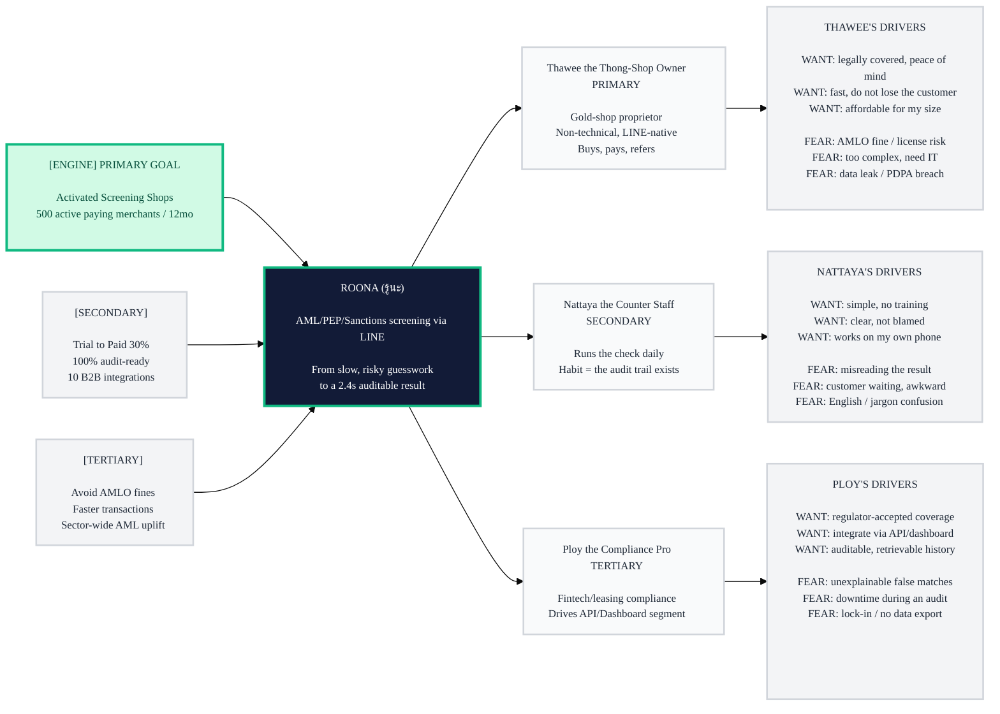

# Trigger Map: ROONA (รู้นะ)

> Visual overview connecting business goals to user psychology
> โครงร่างกลยุทธ์: เชื่อมเป้าหมายธุรกิจ → จิตวิทยาผู้ใช้

**Created:** 2026-06-21
**Author:** Thanissara (generated by Saga, WDS Analyst — Suggest mode from existing docs)
**Methodology:** Effect Mapping (Balic & Domingues), adapted by WDS — with negative driving forces
**Note on style:** No-emoji rule from `Roona/CLAUDE.md` overrides the WDS template emoji. Priority tiers use text labels: [ENGINE] / [SECONDARY] / [TERTIARY]; drivers use WANT: / FEAR:.

---

## Strategic Documents

- **[01-business-goals.md](01-business-goals.md)** — vision + SMART objectives (3 tiers)
- **[personas/02-thawee-the-thong-shop-owner.md](personas/02-thawee-the-thong-shop-owner.md)** — PRIMARY persona
- **[personas/03-nattaya-the-counter-staff.md](personas/03-nattaya-the-counter-staff.md)** — SECONDARY persona
- **[personas/04-ploy-the-compliance-pro.md](personas/04-ploy-the-compliance-pro.md)** — TERTIARY persona
- **[feature-impact-analysis.md](feature-impact-analysis.md)** — features scored against personas
- **[05-key-insights.md](05-key-insights.md)** — design implications

---

## Vision

ทำให้เจ้าของ SME ไทยที่มีหน้าที่ตามกฎหมาย ปปง./AMLO สามารถตรวจลูกค้ากับฐานข้อมูล AML/PEP/Sanctions
ได้ในไม่กี่วินาทีผ่าน LINE — เร็วกว่าการ Google ชื่อ และได้หลักฐาน PDF ที่ยื่นผู้ตรวจสอบได้ทันที.

---

## Business Objectives (3 tiers)

### [ENGINE] PRIMARY: ร้านที่ตรวจเป็นกิจวัตร (Activated Screening Shops)
- **Metric:** จำนวน merchant ที่จ่ายเงินและตรวจ ≥ 1 ครั้งใน 30 วันล่าสุด (active paying merchants)
- **Target:** 500 active paying merchants ภายใน 12 เดือน
- **Impact:** เป็นเครื่องยนต์ที่ขับเคลื่อนทุกเป้าหมายอื่น — รายได้ + การบอกต่อ

### [SECONDARY] (ขับเคลื่อนโดย ENGINE)
- **Trial → Paid conversion:** ≥ 30% ของร้านที่ทดลอง 14 วัน แปลงเป็นจ่ายเงิน
- **Audit-readiness:** 100% ของการตรวจสร้าง PDF audit log ที่ตรวจสอบย้อนหลังได้
- **B2B integration:** 10 fintech/leasing ขนาดกลางใช้ API/Dashboard ภายใน 12 เดือน

### [TERTIARY] (ผลประโยชน์ต่อระบบนิเวศ/สมาชิก)
- SME หลีกเลี่ยงค่าปรับ/ความเสี่ยงใบอนุญาตจาก ปปง.
- ธุรกรรมหน้าร้านเร็วขึ้น ลูกค้าไม่ต้องรอนาน
- ยกระดับมาตรฐาน AML compliance ของภาค SME ไทยโดยรวม

---

## Trigger Map Visualization

---

## The Flywheel — how the loop closes

Thawee (owner) buys and pays → Nattaya (staff) runs a check on every customer because it is effortless →
each check produces a PDF audit log → Thawee sees the shop is provably compliant and never loses a customer
to waiting → Thawee renews and tells other gold-shop owners → Ploy (compliance pro) sees the coverage is
regulator-grade and brings the fintech/leasing API segment. The ENGINE is the *activated, habitual shop*;
everything else is driven by it.

---

## Design Focus Statement

ROONA turns an AMLO-obligated SME owner from someone who avoids or fakes screening because it is slow,
confusing, and expensive — into someone who screens every customer in seconds and can prove it to an
auditor, without an app, an IT team, or a compliance department.

**Primary Design Target:** Thawee the Thong-Shop Owner (decision maker + payer)

**Must Address (critical):**
- FEAR: AMLO fine / license risk → defensible, timestamped PDF audit trail + 11-database, 24h-refreshed coverage
- FEAR: too complex / need IT → LINE-native, no install, OCR from a photo, runs on the staff's own phone
- WANT: fast at the counter → ~2.4s result so the customer never waits
- WANT: affordable → SME pricing, 14-day free trial

**Should Address (supporting):**
- Nattaya needs an unambiguous PASS / REVIEW / HIT status (not color-only) and Thai-first copy
- Ploy needs explainable matches (similarity score + reason), 99.9% uptime, and data export

---

## Cross-Group Patterns

### Shared Drivers
Speed and clarity are wanted by all three: the owner fears losing customers, the staff fears awkward
waiting, the compliance pro fears slow audits. Auditability (the PDF/history) is the proof every tier needs.

### Unique Drivers
- Thawee uniquely carries the legal/financial risk (the fine) and the buying decision.
- Nattaya uniquely needs zero-training simplicity and freedom from blame.
- Ploy uniquely needs integration (API), explainability, and portability.

### Potential Tensions
- Ploy's wants (RBAC, API, granular controls) can add complexity that scares Thawee/Nattaya. Resolution:
  keep the SME LINE flow ruthlessly simple; expose the power features only in the dashboard/B2B tier.

---

## Next Steps

- [ ] Saga: confirm targets/numbers with stakeholder (currently analyst-proposed placeholders)
- [ ] Handoff to Freya → Phase 3 UX Scenarios (the LINE check loop, then the dashboard)
- [ ] Use feature-impact-analysis.md to scope the MVP
- [ ] Validate persona assumptions with real gold-shop owners

---

_Generated with Whiteport Design Studio — Trigger Mapping. Credits: Effect Mapping by Balic & Domingues (inUse)._
